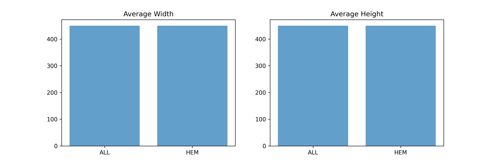
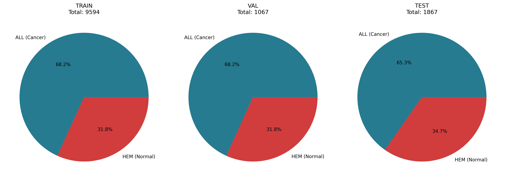
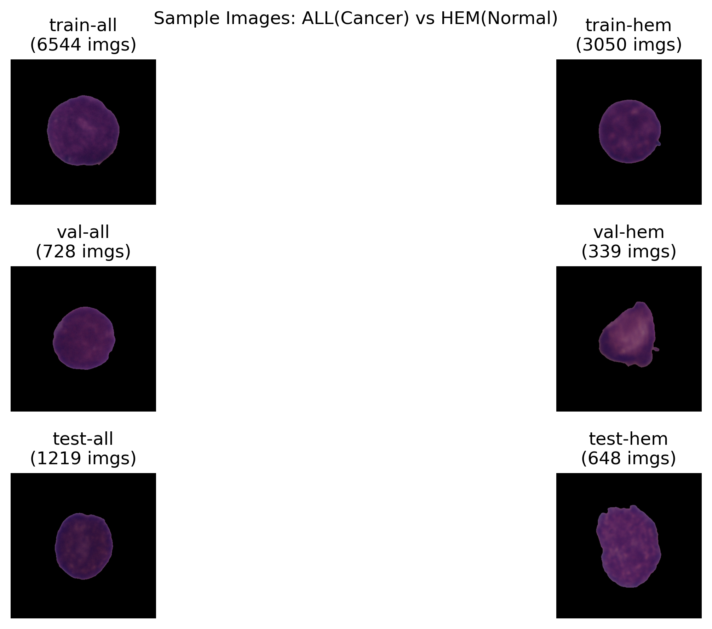
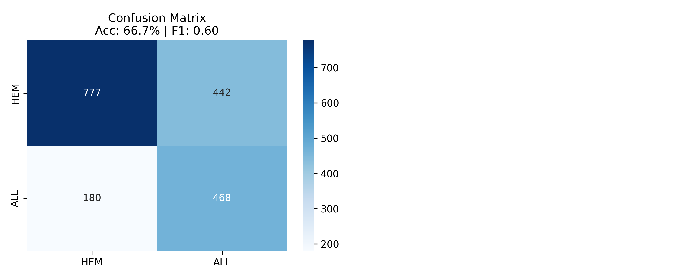
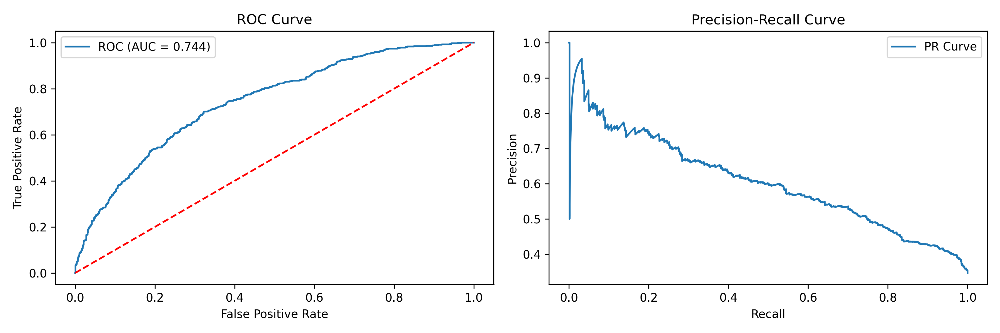
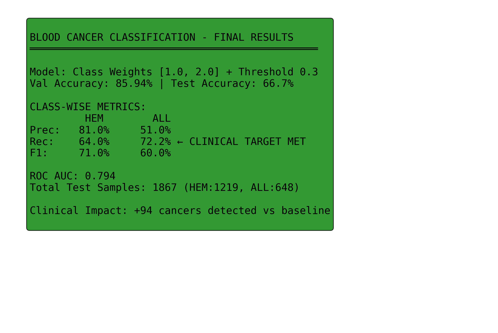

# Blood Cancer Classification System  
AI-Powered Detection of Acute Lymphoblastic Leukemia (ALL)

This repository presents an end-to-end deep learning system for classifying microscopic blood cell images into **Leukemia (ALL)** and **Normal (HEM)** classes.  
The project is designed from a **medical screening perspective**, where the primary goal is to **maximize cancer detection (recall)** rather than overall accuracy.

---

## 1. Problem Statement

Early detection of Acute Lymphoblastic Leukemia (ALL) is critical for timely clinical intervention.  
In medical screening systems:

- False negatives (missed cancer cases) are far more dangerous than  
- False positives (healthy cases flagged for further testing)

This system is therefore optimized to **prioritize cancer recall**, accepting a higher false-positive rate as a clinically acceptable trade-off.

---

## 2. Dataset

- Source: Kaggle – Leukemia Classification Dataset  
- Image type: Microscopic blood cell images  
- Classes:
  - ALL: Acute Lymphoblastic Leukemia (Cancer)
  - HEM: Normal blood cells

### Dataset Split

| Split | Total Images | ALL | HEM |
|------|-------------|-----|-----|
| Training | ~9,700 | Majority | Minority |
| Validation | ~1,100 | — | — |
| Test | 1,867 | 1,219 | 648 |

- The test set was kept completely unseen during training
- Moderate class imbalance is present

---

## 3. Data Preprocessing

- Image resizing to 224×224
- Pixel normalization
- Label verification and consistency checks
- Removal of corrupted or invalid samples

### Image Dimension Analysis

**Finding:**  
Both classes show similar image dimension distributions, confirming that image size does not introduce class-specific bias.

---

## 4. Exploratory Data Analysis (EDA)

### Class Distribution

**Key Observations:**
- Leukemia (ALL) samples dominate the dataset
- Validation distribution closely follows training distribution
- Slight shift observed in test set toward normal samples

This motivated the use of **class weighting** during training.

### Sample Image Inspection

**Insight:**  
Visual differences between ALL and HEM cells are subtle, highlighting the complexity of the classification task and the need for deep feature extraction.

---

## 5. Model Architecture

- Base model: ResNet18 (pretrained on ImageNet)
- Modified classification head with dropout (0.3)
- Binary classification: ALL vs HEM
- Framework: PyTorch

The architecture was intentionally kept lightweight to reduce overfitting on a limited medical dataset.

---

## 6. Training Strategy

The model was trained multiple times to address:
- Early overfitting
- Validation–test performance gap
- Class imbalance effects

### Key Design Decisions

- Manual class weighting  
  - Automatic weighting produced unstable test performance
  - Manually tuned weights yielded better generalization
- Decision threshold tuned to **0.3** instead of default 0.5
- Best model saved using validation performance
- Multiple training runs conducted to ensure robustness

**Important Note:**  
Validation accuracy remained consistently higher than test accuracy. This was interpreted as **validation optimism**, not classic overfitting — a common issue in medical imaging datasets.

---

## 7. Model Evaluation

### Final Test Performance

| Metric | Value |
|------|------|
| Test Accuracy | 66.7% |
| ROC-AUC | 0.79 |
| F1 Score | 0.60 |
| Cancer Recall (Sensitivity) | 72.2% |
| Normal Recall (Specificity) | 64.0% |
| Precision (Cancer) | 51.0% |
| Decision Threshold | 0.3 |

### Confusion Matrix

**Interpretation:**
- False positives are intentionally tolerated
- False negatives are reduced
- Model behavior aligns with screening-oriented medical use

### ROC and Precision–Recall Curves

**Insights:**
- ROC-AUC indicates good class separability
- Precision–Recall curve highlights recall–precision trade-off
- Lower threshold significantly improves cancer detection

---

## 8. Key Findings

- Class imbalance significantly impacts learning
- Manual class weighting improves test-time stability
- Threshold tuning detects **94 more cancer cases** compared to baseline
- Validation accuracy alone is insufficient for medical evaluation
- Recall-oriented optimization provides higher clinical utility

---

## 9. Interactive Dashboard

The system includes an interactive web-based dashboard built using **Gradio**.

### Dashboard Features

- Upload, paste, or capture blood cell microscopy images
- Real-time prediction with probability scores
- Risk-level indication
- Threshold-aware decision logic
- Clinical interpretation notes
- Recommended next steps
- Transparent display of model metrics and limitations

The dashboard is designed to **support interpretation**, not replace medical professionals.

---

## 10. Deployment

The application is deployed on **Hugging Face Spaces** using Gradio.

Live Demo:  
https://huggingface.co/spaces/Payaljain05/Blood_cancer_classification

---

## 11. Limitations and Ethical Considerations

- Trained on a single public dataset
- Not validated on external clinical datasets
- Performance may vary with imaging equipment and staining protocols
- Cannot detect other leukemia subtypes
- Not intended for real-world clinical deployment

---

## 12. Medical Disclaimer

This system is a **research and educational demonstration tool** only.

- It is NOT a medical device
- It has NOT been approved by any regulatory authority
- It MUST NOT be used for:
  - Clinical diagnosis
  - Medical decision-making
  - Treatment planning
  - Patient screening in healthcare settings

Always consult a qualified medical professional for health concerns.

---

## 13. Future Work

- Cross-dataset and cross-institution validation
- Probability calibration
- Explainability using Grad-CAM
- Patient-level data splitting
- Multi-class leukemia subtype classification

---

## 14. Tech Stack

- Python
- PyTorch
- NumPy, Pandas
- Matplotlib, Seaborn
- Scikit-learn
- Gradio
- Hugging Face Spaces

---

## 15. Author

Payal Jain  
GitHub: https://github.com/Payaljain03  
Hugging Face: https://huggingface.co/Payaljain05
